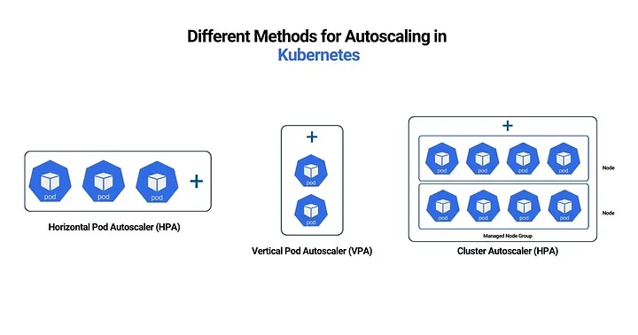

# AutoScaling 

there are three ways we can Scale the pod or resource in kubernetes.
1. HPA- Horizontal pod AutoScaling 
2. VPA- Vertical Pod AutoScaling 
3. CA - Cluster AutoScaling 

# Horizontal Pod Autoscaling

In kubernetes, a HorizontalPodAutoscaler automatically updates a workload resource (such as deployment or StatefulSet).
Horizontal scaling means that the response to increased load is to deploy more Pods.

if the load decreases, and the numbers of pods are above  the configured  minimum, HorizontalPod AutoScaler instruct to workload resource to scale down the Pods.

# Vertical Pod AutoScaling 

Vertical scaling means that the response to increased load is to increase the resources not pod ( such as CPU, Memory etc)

# Cluster Auto Scaling

cluster auto scaling uses where we need nodes,
let suppose there is no resources left in nodes of kubernetes cluster then we configure the Cluster Auto Scaling to scale the number of nodes in a cluster.

