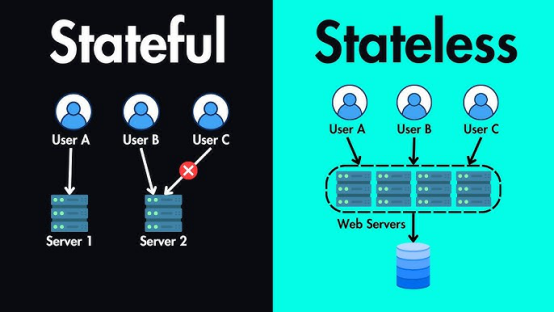
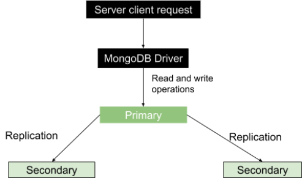

# StatefulSet vs Stateless

StatefulSet:- statefulSet application are those applications which need to persistence volume.
StatefulSet application maintains the state between user and application. it means each pod get special id that id started with 0 number. if somehow pod will be restarted or deleted a new pod will create this pod will get same identical number which previous pod had had.

Stateless:- Stateless application is that application which doesn't need to persistence volume.
it scales parallel. it doesn't maintain the state between state between user and application.

                          **Deployment**          vs      **StatefulSet**

* used to deploy stateless  applications        * used to deploy statefulSet application
* All pod are created parallel                 * All pod are created one by one
* Pods are deleted randomly                     * Pods are deleted in reverse order (suppose 3,2,1)
* Random name is assigned to all the Pods       * sticky and  predictable name is assigned to all pods
* Same pv is used the all pods                  * Different PVs are used the all pods
* Scaling is easy                               * Scaling is difficult

# How to Set up MongoDB Cluster in Kubernetes

    
      kubectl create -f Stateful.yaml
      kubectl get pod -w

      kubectl create headless-service.yaml

      kubectl get svc 

      kubectl exec -it mongo-0 -n default --mongo 
      >
      >  rs.initiate({ _id: "rs0", members: [ { _id: 0, host: "mongo-0.mongo.default.svc.cluster.local:27017" }, { _id: 1, host: "mongo-1.mongo.default.svc.cluster.local:27017" }, { _id: 2, host: "mongo-2.mongo.default.svc.cluster.local:27017" } ] });

      > exit

      kubectl exec -it mongo-0 -n default  --mongo
      
      primary>
      primary> rs.status()
      primary> use test
      primary> db.todos.insert({"title","test"})
      pirmary> db.todos.find()
      { "_id" : ObjectId("671b47fde5da159e1aff37fe"), "title" : "test" }

      primary> exit

 **login with another pod mongo-1**

      kubectl exec -it mongo-1 -n default --mongo
      >rs.slaveOk()
      >db.todos.find()
      { "_id" : ObjectId("671b47fde5da159e1aff37fe"), "title" : "test" }

      > exit

**login with another pod mongo-2**

      kubectl exec -it mongo-2 -n default --mongo 
      > rs.slaveOk()
      > db.todos.find() 
      { "_id" : ObjectId("671b47fde5da159e1aff37fe"), "title" : "test" }
      > exit

