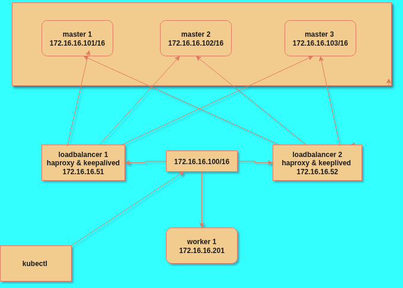

# Set up a Highly Available Kubernetes Cluster using kubeadm

# Kubernetes HA Cluster with HAProxy & Keepalived
 

Follow this documentation to set up a highly available Kubernetes cluster using Ubuntu 20.04 LTS.

This documentation guides you in setting up a cluster with three master nodes, one worker node and two load balancer nodes using Keepalived & HAProxy.

Vagrant Environment

| Role          | FQDN                     | IP             | OS           | RAM  | CPU |
|---------------|--------------------------|----------------|--------------|------|-----|
| Load Balancer | loadbalancer1.example.com| 172.16.16.51   | Ubuntu 20.04 | 512M | 1   |
| Load Balancer | loadbalancer2.example.com| 172.16.16.51   | Ubuntu 20.04 | 512M | 1   |
| Master        | kmaster1.example.com     | 172.16.16.101  | Ubuntu 20.04 | 2G   | 2   |
| Master        | kmaster2.example.com     | 172.16.16.102  | Ubuntu 20.04 | 2G   | 2   |
| Master        | kmaster3.example.com     | 172.16.16.103  | Ubuntu 20.04 | 2G   | 2   |
| Worker        | kworker1.example.com     | 172.16.16.201  | Ubuntu 20.04 | 1G   | 1   |

**Notes:**
- Password for the root account on all these virtual machines: `kubeadmin`
- Perform all commands as **root user** unless otherwise specified.

# Virtual IP managed by Keepalived on the load balancer nodes

Virtual IP
172.16.16.100

**Pre-requisites**

If you want to try this in a virtualized environment on your workstation

KVM installed
Vagrant installed
Host machine has atleast 12 cores
Host machine has atleast 16G memory

**Bring up all the virtual machines**

      vagrant up

If you are on Linux host and want to use KVM/Libvirt

      vagrant up --provider libvirt

# Set up load balancer nodes (loadbalancer1 & loadbalancer2)

**Install Keepalived & Haproxy**
  
      apt update && apt install -y keepalived haproxy

**configure keepalived**

On both nodes create the health check script /etc/keepalived/check_apiserver.sh

        cat >> /etc/keepalived/check_apiserver.sh <<EOF
        #!/bin/sh

        errorExit() {
        echo "*** $@" 1>&2
        exit 1
        }

        curl --silent --max-time 2 --insecure https://localhost:6443/ -o /dev/null || errorExit "Error GET https://localhost:6443/"
        if ip addr | grep -q 172.16.16.100; then
        curl --silent --max-time 2 --insecure https://172.16.16.100:6443/ -o /dev/null || errorExit "Error GET https://172.16.16.100:6443/"
        fi
        EOF

        chmod +x /etc/keepalived/check_apiserver.sh

Create keepalived config /etc/keepalived/keepalived.conf

    cat >> /etc/keepalived/keepalived.conf <<EOF
    vrrp_script check_apiserver {
       script "/etc/keepalived/check_apiserver.sh"
       interval 3
       timeout 10
       fall 5
       rise 2
       weight -2
    }

    vrrp_instance VI_1 {
       state BACKUP
       interface eth1
       virtual_router_id 1
       priority 100
       advert_int 5
       authentication {
         auth_type PASS
         auth_pass mysecret
       }
       virtual_ipaddress {
           172.16.16.100
       }
       track_script {
          check_apiserver
       }
    }
    EOF

**Enable & start keepalived service**

    systemctl enable --now keepalived

**Configure haproxy**

Update /etc/haproxy/haproxy.cfg

      cat >> /etc/haproxy/haproxy.cfg <<EOF

      frontend kubernetes-frontend
          bind *:6443
          mode tcp
          option tcplog
          default_backend kubernetes-backend

      backend kubernetes-backend
          option httpchk GET /healthz
          http-check expect status 200
          mode tcp
          option ssl-hello-chk
          balance roundrobin
              server kmaster1 172.16.16.101:6443 check fall 3 rise 2
              server kmaster2 172.16.16.102:6443 check fall 3 rise 2
              server kmaster3 172.16.16.103:6443 check fall 3 rise 2

      EOF

**Enable & restart haproxy service**

      systemctl enable haproxy && systemctl restart haproxy

**Pre-requisites on all kubernetes nodes (masters & workers)**

Disable swap

       swapoff -a; sed -i '/swap/d' /etc/fstab

Disable Firewall

        systemctl disable --now ufw

Enable and Load Kernel modules

      {
      cat >> /etc/modules-load.d/containerd.conf <<EOF
      overlay
      br_netfilter
      EOF

      modprobe overlay
      modprobe br_netfilter
      }

Add Kernel settings
      {
      cat >>/etc/sysctl.d/kubernetes.conf<<EOF
      net.bridge.bridge-nf-call-ip6tables = 1
      net.bridge.bridge-nf-call-iptables  = 1
      net.ipv4.ip_forward                 = 1
      EOF

      sysctl --system
      }
Install containerd runtime

      {
      apt update
      apt install -y containerd apt-transport-https
      mkdir /etc/containerd
      containerd config default > /etc/containerd/config.toml
      systemctl restart containerd
      systemctl enable containerd
      }

Add apt repo for kubernetes

      {
      curl -s https://packages.cloud.google.com/apt/doc/apt-key.gpg | apt-key add -
      apt-add-repository "deb http://apt.kubernetes.io/ kubernetes-xenial main"
      }

Install Kubernetes components

       {
       apt update
       apt install -y kubeadm=1.22.0-00 kubelet=1.22.0-00 kubectl=1.22.0-00
       }

# Bootstrap the cluster

**On kmaster1**

Initialize Kubernetes Cluster

      kubeadm init --control-plane-endpoint="172.16.16.100:6443" --upload-certs --apiserver-advertise-address=172.16.16.101 --pod-network-cidr=192.168.0.0/16

Copy the commands to join other master nodes and worker nodes.

Deploy Calico network

      kubectl --kubeconfig=/etc/kubernetes/admin.conf create -f https://docs.projectcalico.org/v3.18/manifests/calico.yaml

# Join other master nodes to the cluster

 Use the respective kubeadm join commands you copied from the output of kubeadm init command on the first master.

 IMPORTANT: Don't forget the --apiserver-advertise-address option to the join command when you join the other master nodes.

# Join worker nodes to the cluster

 Use the kubeadm join command you copied from the output of kubeadm init command on the first master

# Downloading kube config to your local machine
On your host machine

       mkdir ~/.kube
       scp root@172.16.16.101:/etc/kubernetes/admin.conf ~/.kube/config

Password for root account is kubeadmin (if you used my Vagrant setup)

# Verifying the cluster
   
        kubectl cluster-info
        kubectl get nodes