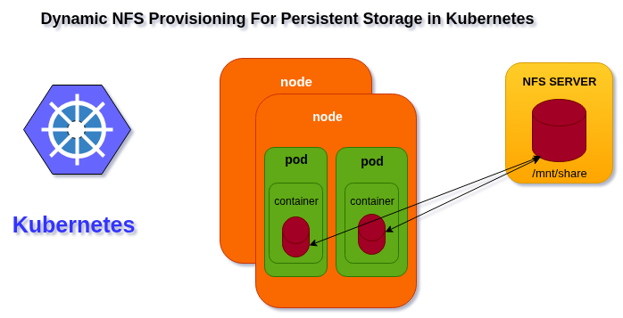

# How to Setup Dynamic NFS Provisioning in a Kubernetes Cluster

Dynamic NFS Storage Provisiong in Kubernetes streamlines the creation and management of NFS volumes for your Kubernetes Applications.IT eliminates the need for manual intervention or pre-provisioned storage.
The NFS provisoner dynamically creates persisten volume (PVs) and associates them with Persistent Volume claim (PVCs), making the process more efficient.
If you have an External NFS share and want to use it in a pod or deployment, the nfs-subdir-external-provisioner provides the solution for effortlessly setting up a storage class to automate the management of your persistent volumes.

**Prerequisites**

Pre-installed Kubernetes Cluster

A Regular user which has admin rights on the Kubernetes cluster

Internet Connectivity

helm3

**Step 1: Installing the NFS Server**

   sudo apt update
   sudo apt-get install nfs-common nfs-kernel-server -y

Create a directory to export:

    sudo mkdir -p /data/nfs
    sudo chown nobody:nogroup /data/nfs
    sudo chmod 2770 /data/nfs

**Export directory and restart NFS service:**

    echo -e "/data/nfs\t10.77.1.0/24(rw,sync,no_subtree_check,no_root_squash)" | sudo tee -a /etc/exports

    sudo exportfs -av

**Restart and show logs**

    sudo systemctl restart nfs-kernel-server
    sudo systemctl status nfs-kernel-server

**Show Export Details:**

    /sbin/showmount -e 10.77.1.212

**Step 2: Install NFS client packages on K8s Nodes**

Make sure all your Kubernetes nodes have the NFS client packages installed. On Ubuntu-based nodes, install nfs-common:

    sudo apt update
    sudo apt install nfs-common -y  

**Step 3: Install and Configure NFS Client Provisioner**

Deploy the NFS Subdir External Provisioner in your Kubernetes cluster to automate the creation and management of NFS-backed Persistent Volumes (PVs) and Persistent Volume Claims (PVCs).

**Add Helm Repository for nfs-subdir-external-provisioner:**

    helm repo add nfs-subdir-external-provisioner https://kubernetes-sigs.github.io/nfs-subdir-external-provisioner

**Install Helm Chart for NFS**
     

        helm install nfs-subdir-external-provisioner \
        nfs-subdir-external-provisioner/nfs-subdir-external-provisioner \
        -n monitoring \
        --create-namespace \
        --set nfs.server=10.77.1.212 \
        --set nfs.path=/home/sarvind/nfs \
        --set storageClass.onDelete=true

**Check pods and storage classes:**

    kubectl get pod -n monitoring
    kubectl get sc -n monitoring

**NFS dynamic storage class was installed and “nfs-client” storage was created.**

    kubectl apply -f nfs-pvc.yaml
    kubectl apply -f deployment.yaml

    kubectl get pvc -n monitoring
    kubectl get pod -n monitoring

# Dynamic NFS Provisioning For Persistence Storage without Helm 

We have configured NFS Provisioning with help of helm, now we will configure without helm.

**Install and Configure NFS Client Provisioner**

We will deploy the NFS Client Provisioner to automate the creation and management of NFS-backed Persistent Volumes (PVs) in your Kubernetes cluster. This provisioner enables dynamic provisioning of PVs using the NFS server you’ve set up.

**Create Storage Class for Dynamic PV Provisioning**

Storage Class defines the provisioning behavior for dynamically created PVs. We will create a storage class called nfs-storage that the NFS client provisioner will use.

     kubectl apply -f nfs-storage.yaml 
     kubectl get sc 

**NFS Client Provisioner Deployment**

Next, we deploy the NFS client provisioner that will interact with the NFS server to provision PVs automatically. Use the following YAML configuration:

     kubectl apply -f nfs-client-provisioning.yaml
     kubectl get pod

**Create a Service Account with Required Permissions**

The NFS client provisioner needs a service account with permission to interact with Kubernetes resources. We will create the necessary permissions using ClusterRole and ClusterRoleBinding.

To ensure the provisioner works correctly and avoids conflicts, we configure leader election using the Role and RoleBinding resources.
   
     kubectl create -f rbac.yaml
     kubectl get clusterrole | grep -i nfs-client-provisioner-runner

